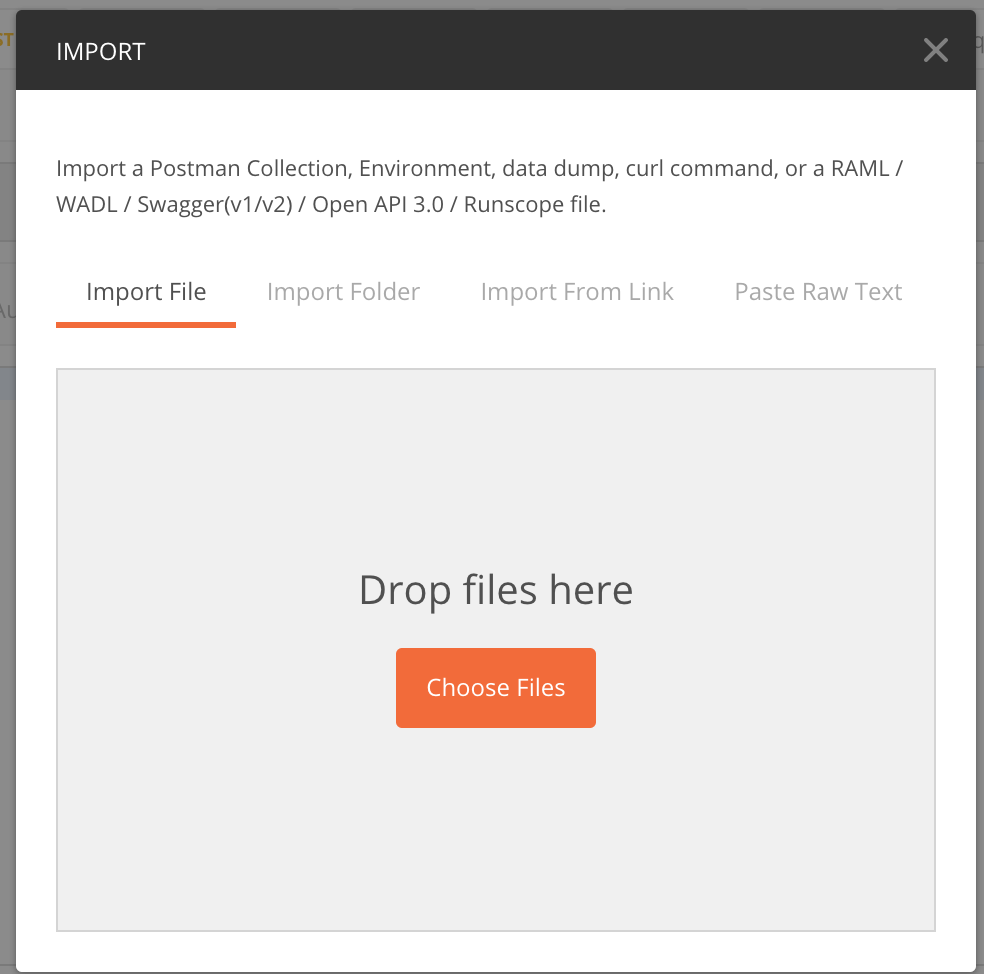

login to your server
run following command to get git repo

`git clone https://github.com/sumedha1101/conference.git \
&& cd conference \
&& chmod +x setup.sh \
&& ./setup.sh `

## How to Inject initial data
using postman import conference.postman_collection.json file in to postman.

Then you will get Collections list as follows 

go to each and every folder and run POST requests

